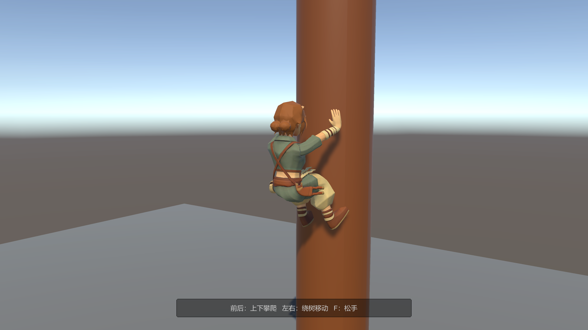

# HULULU · 游戏开发作品集

**Unity 客户端开发 / Gameplay / UI 框架与工具**

围绕角色控制、动作战斗和 UI 架构的两个 Unity 项目。通过可复用模块组织输入、运动、动画与玩法，并为状态切换和边界行为建立验证。

`Unity 2022.3` · `C#` · `Playables` · `Humanoid IK` · `UGUI` · `Input System` · `Addressables`

## 项目

| 项目 | 核心内容 | 技术重点 |
| :--- | :--- | :--- |
| **[TrainingGround →](projects/training-ground.md)** | 3D 动作玩法原型：二段跳、攀爬、三连击、旋风 | 固定步控制、动作时序、接触 IK、技能判定 |
| **[LostHeart →](projects/lost-heart.md)** | 本地双角色合作探索原型：分屏、提灯、怪物与虫群 | 输入分工、玩法 AI、页面框架、UGUI 工具 |

### TrainingGround · 攀爬接触原型

*开发阶段的实际运行截图：规则树干上的手脚接触与攀爬。图片对应当时原型，不代表最终美术或最新全部玩法。*

## 重点能力

- **角色与动作**：分离输入采样、角色规则和固定步运动执行；利用 Playables 组织动作混合、打断与攻击采样。
- **空间与交互**：使用世界空间支撑点和肢体可达性约束处理攀爬；分离攻击数据、碰撞查询与受击响应。
- **UI 架构**：以页面生命周期事件连接调度、内容和动画，接入设置保存与回滚；开发导航与 Stencil 并集裁剪组件。
- **工程组织**：版本化 UPM 包复用运动能力，以编辑器工具和回归检查支持调试。

## 技术拆解

| 阅读入口 | 关注的问题 |
| :--- | :--- |
| [角色控制与动作时序](notes/character-and-combat.md) | 渲染帧输入如何交给固定步？如何让动作姿态与命中窗口对齐？ |
| [PageManager 页面框架](notes/page-framework.md) | 如何分离页面调度、生命周期、过渡动画和设置业务？ |
| [验证记录与工程边界](notes/validation.md) | 已有检查覆盖什么？有哪些尚未完成的内容？ |

## 关于本作品集

作者：**[HULULU-KING](https://github.com/HULULU-KING)**。内容重点为程序实现、系统设计与工程组织。两项目共享部分基础模块，各自展示不同的玩法与技术侧重。

本仓库公开项目介绍、技术拆解和精选运行截图，完整工程源码单独管理，LostHeart 保持私有。项目处于原型开发阶段；当前展示不包含可下载试玩包或完整操作录像。

**模型制作分工**：TrainingGround 中的模型由另一位团队成员制作；LostHeart 中的模型均由作者本人建模。模型制作贡献与程序实现分别说明。

*内容核对：2026-09-13。*
