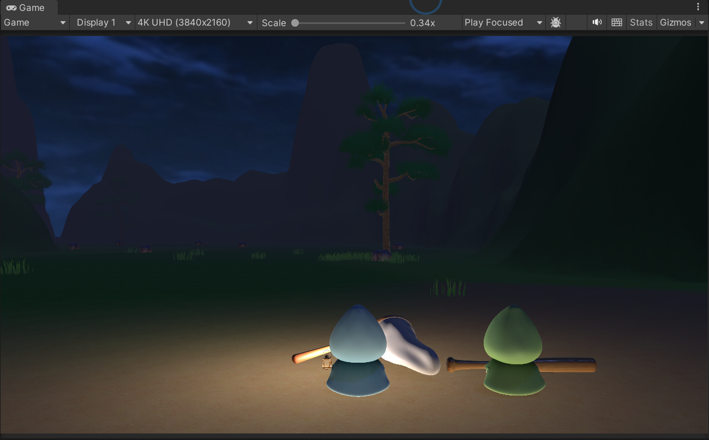
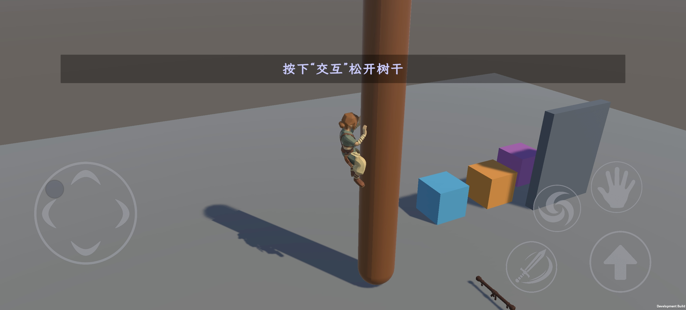

# HULULU · 游戏开发作品集

**Unity 客户端开发 / Gameplay / UI 框架与工具**

围绕自研 UI 框架、输入层、Gameplay 架构、角色动作和移动端接入的两个 Unity 项目。通过可复用模块组织输入、运动、检测、动画与玩法，并为状态切换和边界行为建立验证。

`Unity 2022.3` · `C#` · `Playables` · `Humanoid IK` · `UGUI` · `Input System` · `Addressables`

## 项目

| 项目 | 核心内容 | 技术重点 |
| :--- | :--- | :--- |
| **[TrainingGround →](projects/training-ground.md)** | 3D 动作玩法原型：二段跳、攀爬、三连击、旋风 | 固定步控制、动作时序、接触 IK、技能判定 |
| **[LostHeart →](projects/lost-heart.md)** | 本地双角色合作探索原型：分屏、提灯、怪物与虫群 | 输入分工、玩法 AI、页面框架、UGUI 工具 |

## 项目画面

| LostHeart · 双角色探索 | TrainingGround · 移动端攀爬 |
| :---: | :---: |
|  |  |

*开发阶段的实际运行截图，点击图片查看对应项目。*

*LostHeart 的循环等距导航条：随视角循环滑动，正中标记正前方，绿点指示目标方向。点击图片查看 [实现拆解](notes/compass-navigation.md)。*

## 代表数字

如果只有一分钟，先看这些。以下都是**已记录、可追溯**的量化结果，并标注了适用范围，不代表后续所有版本。

| 方向 | 记录 |
| :--- | :--- |
| TrainingGround 自动化检查 | 编辑模式 **182 / 182**、运行模式 **96 / 96** 通过（2026-09-10；用例有重叠，不合并宣称 278 项独立用例） |
| 移动端包体优化 | 纹理构建占用由约 **2.3 GiB → 166.9 MiB**，对应开发测试 APK 由约 **827 MB → 146 MB**（一次已记录构建结果） |
| 导航条每帧计算量 | 一整圈 60 根刻度，每帧只计算可见的约 30 根；单根位置计算为一次减法 |
| 导航条抽象 | 一套范式 **5 个参数**（总值 / 边界值 / 偏移值 / 成员数量 / 成员表现函数），导航刻度只是其中一个实例 |
| 三段连击 | 50 Hz 物理步下按整数帧划分窗口：第一、二击 `0–20 / 21–50 / 51–80`，第三击 `0–30 / 30–65 / 65–100` |

详见 [验证记录](notes/validation.md)。

## 重点能力

- **自研 UI 框架与组件**：让页面、页内面板、过渡动画和设置业务互不绑死——`PageManager` 提供统一入口、流程细分接口和页面生命周期接口，任意切换都能插入动画。另外解决了三个具体问题：多个图形共用一个遮罩（Stencil 并集 Mask）、焦点该往哪走（可控四方向导航）、罗盘刻度怎么循环（[循环等距导航条](notes/compass-navigation.md)）。
- **Input System 输入层**：让玩法逻辑不依赖具体设备——设备采样统一转成输入快照，键鼠、手柄、触控共用同一份数据；支持本地双人输入分配、运行时改键与配置快照回滚。
- **Gameplay 对象与检测架构**：让"换模型、改判定范围"不影响对象身份——逻辑根与模型、挂点、移动体、攻击体、Hitbox 分层；空间判断按用途分开（实体碰撞、`SphereCast`、注册表对点、NonAlloc 主动查询）。
- **交互与战斗数据流**：让拾取和命中不会重复结算——以 `WeaponItem.owner` 作为武器归属的唯一来源，完成事务式拾取与主副手交换；以 `HitData + IHitReceiver` 解耦攻击方与受击方，按接收器去重。
- **角色动作模块**：让渲染帧输入与物理固定步对齐——运动模块封装为固定版本 UPM 包复用；用 Playables 与数据配置组织动作混合、打断、三段连击和命中窗口。
- **攀爬与移动端**：把"角色沿树干移动"和"身体如何保持接触"分成两层，用手脚接触约束与 IK 生成姿态；完成多点触控、浮动摇杆、拖拽定向施法、移动纹理处理和 Android 测试包导出。

## 技术拆解

| 阅读入口 | 关注的问题 |
| :--- | :--- |
| [角色控制与动作时序](notes/character-and-combat.md) | 渲染帧输入如何交给固定步？如何让动作姿态与命中窗口对齐？ |
| [Gameplay 对象、检测与战斗架构](notes/gameplay-architecture.md) | 为什么区分四类检测？交互、武器、命中、AI 和动态光照如何协作？ |
| [PageManager 页面框架](notes/page-framework.md) | 如何分离页面调度、生命周期、过渡动画和设置业务？ |
| [循环等距导航条](notes/compass-navigation.md) | 循环刻度怎么摆最省？四个已经实现的功能为什么被主动砍掉？ |
| [验证记录与工程边界](notes/validation.md) | 已有检查覆盖什么？有哪些尚未完成的内容？ |

## 关于本作品集

作者：**[HULULU-KING](https://github.com/HULULU-KING)**。内容重点为程序实现、系统设计与工程组织。**项目中的程序实现、系统设计与本仓库文档均由作者完成**；两项目共享部分基础模块，各自展示不同的玩法与技术侧重。

本仓库公开项目介绍、技术拆解和精选运行截图，完整工程源码单独管理，LostHeart 保持私有。项目处于原型开发阶段；当前展示不包含可下载试玩包或完整操作录像。

**模型制作分工**：TrainingGround 中的模型由另一位团队成员制作；LostHeart 中的模型均由作者本人建模。模型制作贡献与程序实现分别说明。

*内容核对：2026-09-19。*
