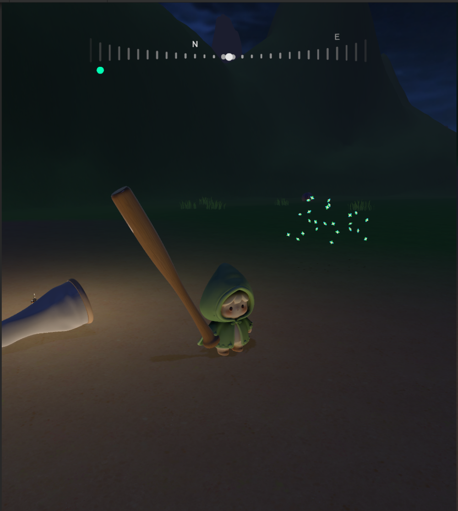

# 循环等距导航条：把一次 UI 需求抽成可复用解法

[返回 LostHeart](../projects/lost-heart.md) · [作品集首页](../README.md)

## 一句话

屏幕顶部一条横向刻度带，随摄像机水平朝向**反向平滑滑动**。玩家扫一眼就知道两件事：**自己朝哪、目标在哪**。

它服务于 LostHeart 的任务指引，但真正的产出是两样东西：一个**组件**，和一套从组件里抽出来的**通用算法范式**。


*刻度带本体。两端刻度高、向中间收缩为小点；正中白点表示正前方，下方绿点表示目标方向。*



*实机画面：导航条位于屏幕顶部，与场景光照、分屏布局和角色状态共存。*

## 先排除掉两个更常见的做法

动手前先否掉了两个方案，理由都不是"做不到"，而是**画面语言不统一**：

| 方案 | 为什么不选 |
| :--- | :--- |
| **小地图** | 必然占住屏幕一角，破坏画面对称；面积大、信息杂，会把玩家视线从场景里拽走。需要看全局时改用"按键打开的大地图"，看完关掉 |
| **屏幕边缘飘箭头** | 在边缘游走会显得凌乱；做成圆形罗盘，又与矩形画面横平竖直的语言冲突 |

横向罗盘是一条与屏幕上下边缘平行的带子，它**本身就是矩形画面的一部分**，不需要额外为它让出空间。

## 三条设计原则，以及主动砍掉的东西

| 原则 | 落到画面上是什么 |
| :--- | :--- |
| **灵动** | 指示器一眼可见；"中间小、两边大"配合纵向偏移模拟近大远小，用离散竖条营造立体罗盘的错觉；指示器在刻度之间平滑过渡而不是瞬移 |
| **机械化** | 等距、离散、左右对称，营造机械罗盘那种精密规整的质感 |
| **简洁** | 整个界面只有等距竖条 + 几个圆 + 4 个字母。它只是一个工具，不该抢画面、抢信息 |

因为"简洁"，下面这些**做出来之后又被主动砍掉**（代码保留、面板关闭）：

| 砍掉的东西 | 原因 |
| :--- | :--- |
| 提示箭头 | 不符合简洁性与对称性 |
| 中心多枚固定装饰 | 多余，且占用了"圆弧"这个形状 |
| 刻度高度的波浪 / 延迟动画 | 属于无用信息，反而妨碍"一眼看到指示器" |
| 刻度变色指示 | 方向快速变化时根本看不清哪根变了色——最终改成刻度下方的独立图标 |

> 功能做出来不难，**知道哪个该留、哪个该删才是设计**。这一节是整页里最能说明判断力的部分。

## 核心：循环等距变化赋值范式

一组成员按统一间隔排列在一个循环值域中。外部偏移连续变化时，只显示边界内的成员，并按成员相对中心的位置改变表现。**导航刻度只是它的一个实例**，同样的写法可以直接用于轮盘、循环选择器、循环 Page UI。

```text
范式参数   = （总值，边界值，偏移值，成员数量，成员表现函数）
导航条实例 = （360°，180°，摄像机航向，4n，高度随方向变化）
```

范式**不关心成员数量和间隔具体是多少**——所以"每象限刻度数"和"横向间隔"都是可调输入，而不是写死的常量。

### 反向求解，而不是逐点判断

| | 做法 | 代价 |
| :--- | :--- | :--- |
| 朴素 | 每根刻度都代入位置公式，再逐根判断是否越界 | 每根都要取模、乘除，越界判断重复 N 次 |
| **实际** | **先逆向求出边界上那一根**，从它开始按固定间隔摆放，其余直接关闭 | 位置退化成等差数列 `s = b - i·D`，**每根只做一次减法**；可见数量一次算出，不逐根判断 |

中心成员同理：只检查两个候选，用半开半闭区间保证**每帧只有一个**中心刻度，不会在正中间同时冒出两根。

### 每帧执行顺序


方位文本、目标指示器和圆弧中心都使用**缩放前**的理论边界定位，因此它们不会随中心那根刻度的放大而向外漂移。

## 组件与预制体解耦

导航组件**只往刻度的根对象写 6 个值**——宽度、高度、Pivot、横向位置、颜色、显隐。刻度内部三段怎么切、怎么摆，由预制体自己的布局组件决定。

| 导航组件写什么 | 预制体怎么处理 |
| :--- | :--- |
| 根对象宽度 / 高度 | 按规则算出上、中、下三段各自的尺寸和位置 |
| 根对象纵向 Pivot | 不用管——三段以根对象中心为基准，整体跟随 |
| `CanvasGroup.alpha` | 直接生效（整根刻度一起淡出），预制体不参与 |
| `SetTint(颜色)` | 转发给它认为该染色的那几张图 |
| `SetGraphicVisible(显隐)` | 只开关图像，**不动根对象和运行数据** |

这样做的收益：

- **换美术不用改逻辑**：只换 Prefab，导航算法一行都不用动；
- **改分块方式也不用改逻辑**：三段改五段、或干脆整图不切，都只动预制体——因为导航组件调的是 `SetTint` / `SetGraphicVisible` 这类**语义接口**，而不是"把第 2 张图染成绿色"。

显隐只关图像、不关根对象，是为了让被遮住的刻度仍保留运行数据——中心固定装饰遮挡附近刻度时就是这么处理的。

## 性能

| 措施 | 效果 |
| :--- | :--- |
| 布局组件**不写 `Update`** | 只挂 `OnEnable` / `OnValidate` / `OnRectTransformDimensionsChange` 等回调；尺寸没变就一次都不算 |
| **只算可见成员** | 以当前配置为例：一整圈 60 根，每帧通常只算屏幕上那约 30 根，其余直接关闭，不参与任何计算 |
| 位置用**等差数列递推** | 不做逐点公式，每根只做一次减法 |
| **写入前先比较** | 尺寸、Pivot、颜色、显隐都"不同才写"，避免每帧把 Canvas 标脏、触发网格重建 |
| 数组**不每帧分配** | 只在成员数量变化时重建，不产生垃圾 |

## 工具链：面板不是手摆的

- **自定义 Inspector**：中文分组，并按当前模式隐藏无关参数（例如"中心高度倍数"只在"中间大"模式出现），降低误调成本。
- **场景生成器**：一键重建全部刻度、方位文本、指示器和中心标记，支持 `Ctrl+Z` 撤销；只删除自己上次记录的对象，不会误伤手工摆放的内容。
- **运行时接口**：`SetIndicatorTarget` / `ClearIndicatorTarget` 供任务系统在接取与完成时调用，设置后立即对位；另有 `RefreshLayout`、`SetPointerStandardGeometry` 等调试与演出入口。

## 边界与未完成

- 当前只支持**一个目标**；多目标需要把引用改成集合并管理各自状态；
- 提示箭头已决定不做；
- 方位文本、指示器与圆弧中心使用**缩放前**的理论边界，不随最终视觉缩放外移；
- 显示角度限制在 `(0, 360]`，不处理同一成员在一个周期内重复出现的情况；
- 视觉验收依靠场景内人工观察，**未纳入自动化测试**。

**继续阅读：[LostHeart](../projects/lost-heart.md) · [PageManager 页面框架](page-framework.md) · [验证记录](validation.md)**
