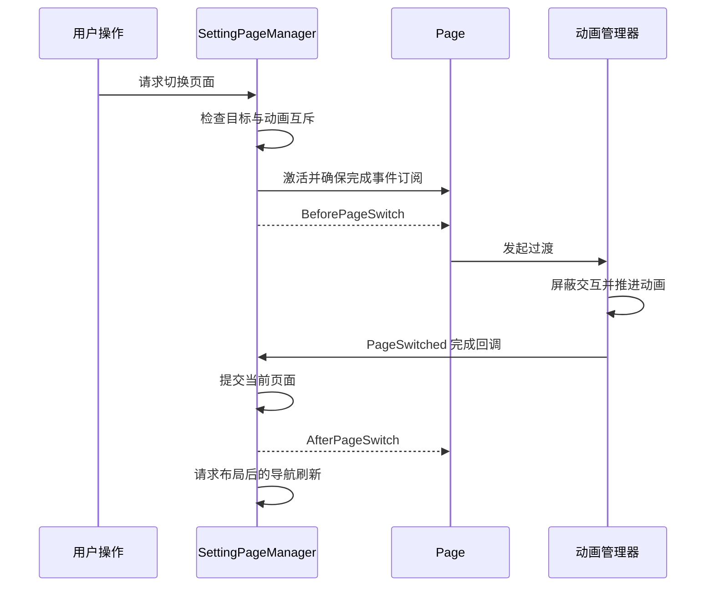

# PageManager：事件驱动的页面框架

[返回 LostHeart](../projects/lost-heart.md) · [作品集首页](../README.md)

## 解决的问题

页面切换同时涉及内容激活、过渡动画、导航焦点和设置状态。如果让按钮事件直接操作全部对象，页面增多后容易出现切换重入、动画未结束就更改状态、未保存配置残留等问题。

实现采用生命周期事件连接各模块，将请求、内容、表现和业务分开。

## 职责划分

| 模块 | 职责 |
| :--- | :--- |
| `PageManager` | 当前页面状态；开关、切页、切面板的前后事件；动画完成回调 |
| `SettingPageManager` | 请求校验、动画互斥、输入屏蔽、返回路径与导航刷新 |
| `Page / ModePanel` | 内容生命周期、可视对象激活与面板切换 |
| `PageAnimationManager` | 过渡动画接口、播放状态、交互门控 |
| `SettingPageAnimationManager` | 可配置的设置页过渡动画及动画参数 |
| 具体设置面板 | 保存、重置、已确认快照及离页回滚 |

设置保存与回滚属于具体业务面板，基类提供生命周期接入点，避免把通用页面层绑定到某一种设置。

## 切换流程

## 关键处理

- **防止切换重入**：动画播放期间拒绝新的开关、切页与切面板请求；切换到当前页面直接忽略。
- **保证事件可达**：目标页面未激活时先处理可视位置，再激活并完成订阅，随后发布事件。
- **区分游戏与 UI 时间**：过渡动画使用 `Time.unscaledDeltaTime`，游戏时间暂停时仍可完成过渡。
- **输入锁独立持有**：设置页只修改自己的输入屏蔽标志，关闭时不解除其他系统的锁。
- **设置事务**：业务面板维护已确认快照，保存后更新基线，离页时回滚未保存改动。
- **布局后刷新导航**：将同帧请求合并，在 Canvas 布局完成后按最终位置计算焦点关系。

这套实现用于实际设置界面，重点是清晰的职责边界和生命周期管理；不宣称已覆盖所有类型 UI 或提供完整 MVVM 数据绑定。
