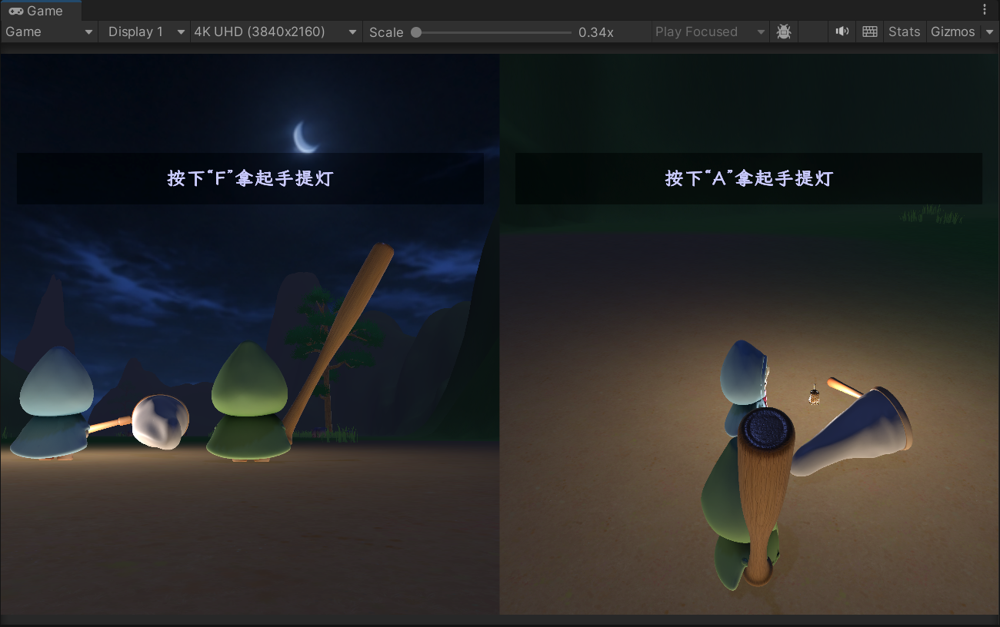
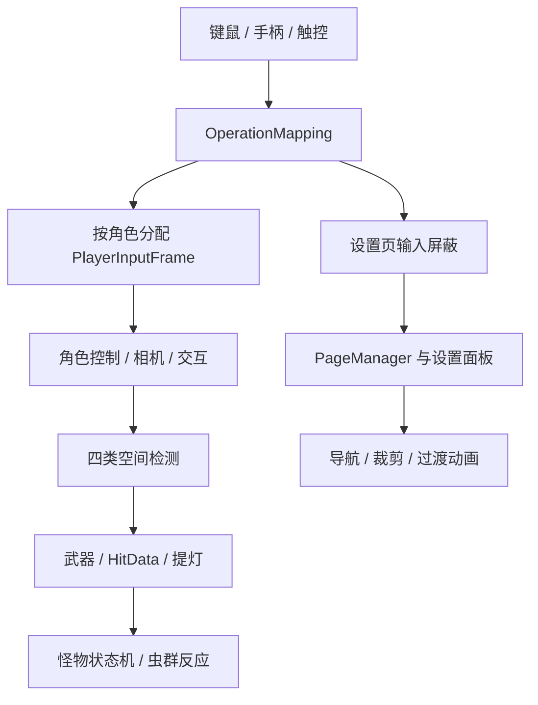

# LostHeart

**Unity 本地双角色合作探索原型** · [返回作品集](../README.md)

以双角色、提灯、怪物和虫群之间的互动组织探索玩法。项目同时承载输入、Gameplay 对象与检测架构、页面管理和 UGUI 工具的实际接入，展示从基础模块到玩法系统的整合。

**技术栈**：Unity 2022.3、C#、Input System、UGUI、Addressables、CharacterController、有限状态机。

**个人贡献**：除本页介绍的程序与工具开发外，项目中的模型均由本人建模，结合 Blender → Unity 流程完成模型制作与引擎接入。

## 游戏画面

*双角色、提灯与黑暗森林场景；画面中的角色和道具模型由本人制作。*

*本地双人分屏运行画面：键鼠与手柄角色分别收到提灯拾取提示。*

*屏幕顶部的循环等距导航条：正中固定标记表示正前方，下方绿点指示目标任务方向。*

## 核心实现

### 基于 Input System 的输入层

将设备采样转换为统一的 `PlayerInputFrame` 输入快照，玩法、角色和相机只消费快照，不直接依赖具体设备。支持键鼠、手柄和触控接入，按角色分配输入；运行时改键包含冲突处理、取消恢复、配置持久化与已确认快照回滚。多个系统分别持有输入屏蔽标志，避免一个界面关闭时误解除其他系统的输入锁。

本地双角色使用独立相机和视口，支持单/双屏切换与 FOV 补偿；移动模式可切换当前控制角色。这里的双人能力是本地输入与分屏，不是网络联机。

### Gameplay 对象与四类检测

玩家、怪物和武器均使用稳定逻辑根，模型、手部挂点、移动体、攻击查询体、受击 Hitbox 与交互范围各自分层。替换模型或调整判定范围时，不需要改变输入、状态机和持有关系保存的对象身份。

空间判断按用途分为四类：`CharacterController` 实体碰撞负责地形、坡面和撞墙；`SphereCast` 负责相机避障；注册表候选后的距离/方向公式负责交互、索敌和光源范围；Collider 模板配合 `OverlapColliderNonAlloc` 负责攻击命中。攻击和交互不依赖 Trigger 进入/退出回调，时机分别由攻击窗口和当前目标排序控制。

[查看对象、检测、交互与战斗架构 →](../notes/gameplay-architecture.md)

### 交互、武器与统一受击

可交互对象通过注册表提供候选，再按距离、前后关系和横向偏移选择目标。拾取先锁定物品与玩家，再完成槽位决策、归属写入和手部挂载，避免两名玩家同帧获得同一实例。`WeaponItem.owner` 是攻击、手提灯和交换流程的唯一归属来源，支持放下后恢复交互、主副手切换以及带超时和冷却的玩家间交换。

战斗只在攻击有效窗口执行主动 NonAlloc 查询，以 `IHitReceiver` 而不是 Collider 作为去重单位；统一 `HitData` 携带伤害、扣光、击飞和攻击者信息，由玩家、怪物或萤火虫自行处理。这样同一目标的复合 Hitbox 只结算一次，同一虫群中的多个独立个体仍能分别命中。

### 提灯、怪物与虫群

怪物有限状态机覆盖休眠、苏醒、追击、瞄准、后撤、冲刺、恢复和暴怒；目标选择结合提灯持有者与玩家状态。虫群维护可衰减的威胁来源，通过距离加权的威胁梯度选择逃离方向，并联动附近怪物唤醒。

技能触发采用失败次数递增的 PRD；通过二分求系数，使长期触发概率接近配置的名义概率。

虫群将个体随机飞行与群体逃离分开：个体在局部空间使用三轴独立路径，群体根据多个威胁源的距离和威胁度合成逃跑速度与方向，并联动点光变化和附近怪物唤醒。手提灯、祭坛和局部灯通过注册表向自制 `SkinLit` 材质提供动态打光数据。

### 自研 PageManager 页面框架

框架可自由接入多层页面和页内模式面板，统一管理页面打开/关闭、页面间切换和页面内部面板切换。每类切换都提供对外总入口、流程细分接口及对应页面生命周期接口，可按需插入不同过渡动画，而不让页面内容直接依赖具体动画实现。

过渡期间拒绝重复请求并控制输入，动画完成后再提交页面状态。设置面板支持保存、重置和未保存修改回滚；过渡动画使用不受游戏时间缩放影响的时间增量。

[查看页面框架职责与流程 →](../notes/page-framework.md)

### UGUI 工具与资源加载

| 工具 | 实现重点 |
| :--- | :--- |
| 可控四方向导航 | 候选列表、三角形区域划分、梯度权重/序列排序，回填原生 Explicit navigation；支持布局后合并刷新与 Scene 可视化 |
| 多图形并集裁剪 | 多个 Graphic 写入同一 Stencil 值形成并集，管理动态绑定、材质创建/释放和编辑器同步；同一 Stencil 运算思路可继续扩展交集规则，当前交付为并集实现 |
| 循环等距导航条 | 先逆向求边界成员，再用等差数列摆放可见刻度、其余直接关闭；导航组件与预制体分层，组件只向根对象写入 6 个值；配套自定义 Inspector 与一键重建生成器 |
| 章节异步加载 | Addressables 初始化、依赖下载量检查、进度反馈、场景加载与句柄生命周期 |

导航和裁剪组件均包含 Runtime、Editor、Tests 结构、示例与文档，并接入实际 StartScene。

[查看循环等距导航条的算法、取舍与性能处理 →](../notes/compass-navigation.md)

### 跨平台输入、渲染与构建资源

Desktop/Mobile 运行模式隔离硬件输入和相机布局；移动模式只读取触屏快照并只控制当前角色。Android 切换中修正了 Terrain 渲染路径和自制 `SkinLit` 对 glTF 法线的跨平台解码问题。

针对 GLB 内嵌 4K 纹理，构建前生成并临时使用 1K 移动缓存，构建完成后恢复源资源且保持 GUID 与场景引用。历史 Build Report 中纹理构建占用由约 **2.3 GiB 降至 166.9 MiB**，对应开发测试 APK 由约 **827 MB 降至 146 MB**；该数字是一次已记录构建结果，不代表后续所有版本体积。

## 模块关系

## 可复查的实现入口

| 方向 | 类型 / 文件 |
| :--- | :--- |
| 输入、改键与分屏 | `OperationMapping`、`MobileTouchInputController`、`SplitScreenManager` |
| 对象注册与空间检测 | `EntityRegistry`、`InteractableRegistry`、`PlayerInteractCheck`、`PhysicsQuery` |
| 武器与命中接口 | `WeaponItem`、`MeleeHitTrigger`、`HitData`、`IHitReceiver` |
| 玩法 AI | `ForestMonsterController`、`GlowwormGroup`、`PseudoRandom` |
| 页面框架 | `PageManager`、`Page`、`PageAnimationManager`、`SettingPageManager` |
| UI 工具 | `HLL_UINavigator`、`HLL_UINavigationManager`、`HLLMask`、`HLLMaskImage` |
| 循环等距导航条 | `HLLMapStripNavigation`、`HLLMapStripNavigationMath`、`Pointer_Layout_HLLMapStrip`、`Centre_Layout_HLLMapStrip` |
| 资源加载 | `GameplaySceneLoader` |

## 项目状态

当前为开发中的探索原型，面向 PC 与移动端继续制作。完整源码保持私有，本页公开实现思路与技术结构。联网、主机适配和商业上线不作为已完成成果展示。

**继续阅读：[Gameplay 对象、检测与战斗架构](../notes/gameplay-architecture.md) · [PageManager 页面框架](../notes/page-framework.md) · [TrainingGround](training-ground.md)**
