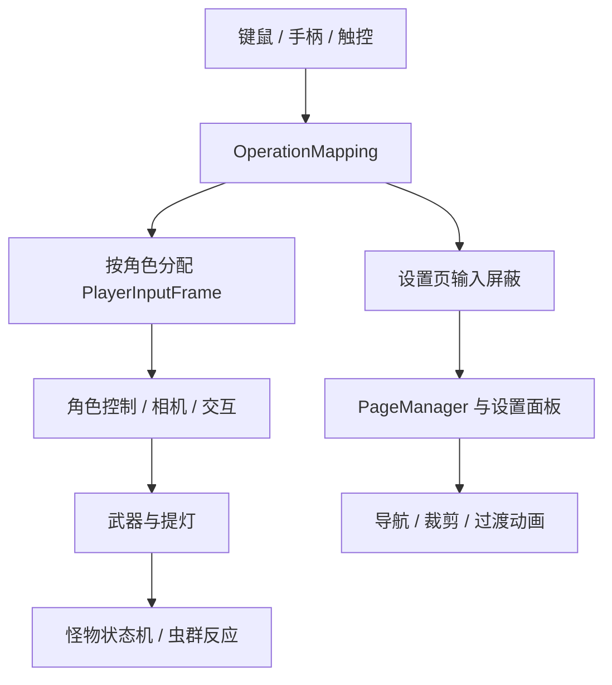

# LostHeart

**Unity 本地双角色合作探索原型** · [返回作品集](../README.md)

以双角色、提灯、怪物和虫群之间的互动组织探索玩法。项目同时承载输入、页面管理和 UGUI 工具的实际接入，展示从基础模块到玩法系统的整合。

**技术栈**：Unity 2022.3、C#、Input System、UGUI、Addressables、CharacterController、有限状态机。

## 核心实现

### 多设备输入与双角色

统一键鼠、手柄和触控的输入结构，按角色分配输入；支持改键冲突处理、取消恢复、配置持久化，以及多个系统分别持有的输入屏蔽标志。

本地双角色使用独立相机和视口，支持单/双屏切换与 FOV 补偿；移动模式可切换当前控制角色。这里的双人能力是本地输入与分屏，不是网络联机。

### 提灯、怪物与虫群

怪物有限状态机覆盖休眠、苏醒、追击、瞄准、后撤、冲刺、恢复和暴怒；目标选择结合提灯持有者与玩家状态。虫群维护可衰减的威胁来源，通过距离加权的威胁梯度选择逃离方向，并联动附近怪物唤醒。

技能触发采用失败次数递增的 PRD；通过二分求系数，使长期触发概率接近配置的名义概率。

### PageManager 页面框架

**以生命周期事件解耦页面调度、内容处理与过渡动画**，设置业务通过独立面板扩展。页面打开/关闭、页面切换和内部面板切换具有明确的前后事件；过渡期间拒绝重复请求并控制输入，动画完成后提交页面状态。

设置面板支持保存、重置和未保存修改回滚；过渡动画使用不受游戏时间缩放影响的时间增量。

[查看页面框架职责与流程 →](../notes/page-framework.md)

### UGUI 工具与资源加载

| 工具 | 实现重点 |
| :--- | :--- |
| 四方向导航 | 候选列表、三角形区域筛选、权重/序列排序，回填原生 Explicit navigation；支持布局后合并刷新与 Scene 可视化 |
| 多图形并集裁剪 | 多个 Graphic 写入同一 Stencil 值，管理动态绑定、材质创建/释放和编辑器同步 |
| 章节异步加载 | Addressables 初始化、依赖下载量检查、进度反馈、场景加载与句柄生命周期 |

导航和裁剪组件均包含 Runtime、Editor、Tests 结构、示例与文档，并接入实际 StartScene。

## 模块关系

## 可复查的实现入口

| 方向 | 类型 / 文件 |
| :--- | :--- |
| 输入、改键与分屏 | `OperationMapping`、`MobileTouchInputController`、`SplitScreenManager` |
| 武器与命中接口 | `WeaponItem`、`MeleeHitTrigger`、`HitData`、`IHitReceiver` |
| 玩法 AI | `ForestMonsterController`、`GlowwormGroup`、`PseudoRandom` |
| 页面框架 | `PageManager`、`Page`、`PageAnimationManager`、`SettingPageManager` |
| UI 工具 | `HLL_UINavigator`、`HLL_UINavigationManager`、`HLLMask`、`HLLMaskImage` |
| 资源加载 | `GameplaySceneLoader` |

## 项目状态

当前为开发中的探索原型，面向 PC 与移动端继续制作。完整源码保持私有，本页公开实现思路与技术结构。联网、主机适配和商业上线不作为已完成成果展示。

**继续阅读：[PageManager 页面框架](../notes/page-framework.md) · [TrainingGround](training-ground.md)**
