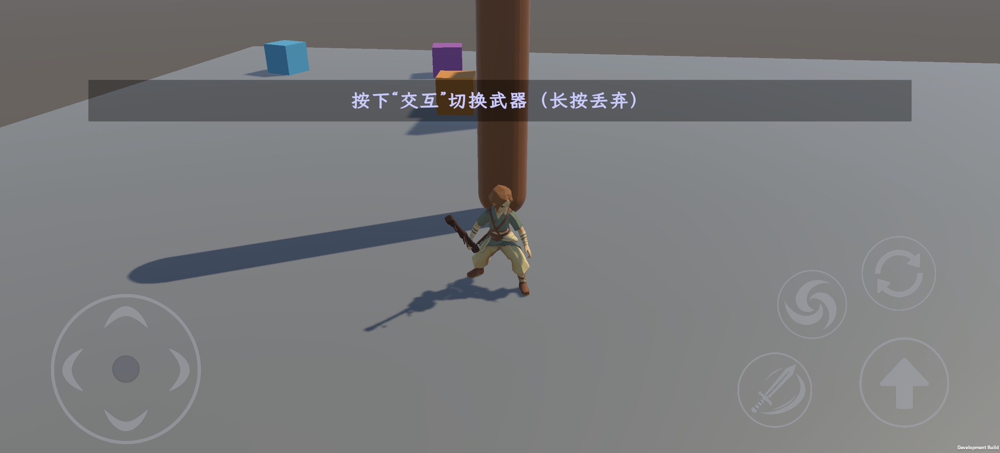

# TrainingGround

**Unity 3D 动作玩法原型** · [返回作品集](../README.md)

在小型训练场中验证角色运动、攀爬接触、攻击动作和技能交互。开发重点是将连续操作中的规则、位移、动画和碰撞组织成可维护的实现。

**技术栈**：Unity 2022.3、C#、CharacterController、Playables、Humanoid IK、Input System、ScriptableObject。

**协作分工**：本页展示角色控制、动作系统与玩法程序实现；项目中的模型由另一位团队成员制作。

## 移动端运行画面

| 武器切换与触控操作 | 树干攀爬与接触交互 |
| :---: | :---: |
|  |  |

*Android 开发测试包实机截图，展示浮动摇杆、动作按钮、交互提示及玩法状态切换。*

## 核心实现

| 模块 | 实现 | 对应能力 |
| :--- | :--- | :--- |
| 角色运动 | 固定步移动、二段跳、坡面判定、击飞；普通运动与受控攀爬统一调度 | 更新时序、状态规则、运动模块封装 |
| 动作与连击 | Playables 混合及打断；ScriptableObject 配置三段连击，固定步推进预读和命中窗口 | 数据驱动、动画与逻辑协作 |
| 树干攀爬 | 上下移动与周向绕树；世界空间支撑点、手脚换点、IK 和可达性约束 | 空间几何、接触保持、姿态连续性 |
| 定向技能 | 按住瞄准、拖动取消、松手释放；旋风扫掠、墙体截断、单次击飞 | 触控交互、碰撞查询、技能流程 |
| 摄像机 | 第三人称与 MOBA 斜俯视模式并存；鼠标/触屏调向、遮挡物渐隐且保留投影 | 相机模式、遮挡查询、材质属性控制 |
| 工程复用 | 运动模块以固定版本 UPM 包接入，输入、动画和玩法规则保留在项目层 | 依赖边界、版本管理 |
| 移动端接入 | 多点触控、浮动摇杆、拖拽定向施法；URP 移动构建纹理处理与 Android 测试包导出 | 输入路由、资源构建、平台适配 |

## 攀爬：把"沿树移动"和"保持接触"分成两层

*规则树干攀爬的历史运行截图。*

这套攀爬**不是让一段固定动画推着角色走**，而是分成两层：**角色控制层**计算根节点沿树干外侧圆柱轨道的路线，**动作层**再根据真实骨长和当前支撑点生成最终姿态。换一套骨骼、或换一棵粗细不同的树，路线逻辑都不用改。

| 模块 | 职责 |
| :--- | :--- |
| `ClimbableTree` | 从 `CapsuleCollider` 读取树干轴线、世界半径和可攀爬直段，提供表面点、法线、上下限与绕树角度 |
| `PlayerTreeClimber` | 发现目标、抓附、进入、攀爬、停留、松手的完整状态；把前后输入换算成高度变化，左右输入换算成绕树角度 |
| `CharacterMovement.MoveGuided` | 攀爬期间关闭自由落体，仍通过 `CharacterController` 执行带碰撞的受控位移；松手后恢复普通移动与重力 |
| `ClimbContactIK` | 规划手脚换点，调整骨盆与躯干，再求解肩肘腕髋膝踝与手指，使四肢落到当前树面接触点 |

抓附分为 `Free → Entering → Climbing` 三个阶段：进入时共享进度控制路径引导与姿态混合，避免按下交互后瞬间跳位或抽搐；到达允许误差后才接管移动。攀爬期间普通地面移动、重力和跳跃暂时停止。

**姿态原则是"三点保持、一点换位"**：一只手或一只脚离开树面时，其余接触点继续承重。接触点处于支撑状态时**固定在世界空间不动**——身体移动先改变肩、髋与支撑点的相对关系，骨链随之弯曲旋转，而不是让承重的手掌在树面上滑动。上爬、下爬和横向绕树各自采用不同的手脚先后顺序；松手时先平滑降低根节点速度、完成已经开始的换点，再回到稳定停留姿态，避免四肢停在半空。

约束上有两条硬线：**骨骼只旋转、不拉长**；目标超出臂长或腿长时**优先调整身体距离与骨盆位置**，而不是强行把手脚钉到不可达位置。手掌按树面切平面调整，换手时先离开表面、再沿平滑弧线到达新抓点。

树干表面和接触点按**世界半径**计算；树干半径或尺寸变化时重新拟合抓附位置和支撑点，使同一套攀爬逻辑适配不同半径的规则树干。当前对象为规则胶囊树干，不扩展宣称任意地形攀爬或顶部翻越。

## 动作战斗：统一采样顺序

木棍作为独立武器接入，带持有者归属、主副手槽位、拾取与丢弃；**攻击输入只由当前持有者读取，攻击期间限制切换和丢弃**，避免动作做到一半换武器。

三连击的动作区间、预读窗口和衔接帧由配置驱动。动作被打断或武器持有者变化时，清理攻击状态与表现，避免旧攻击继续结算。当前木棍使用随挥击轨迹生成的剑气效果；飞行剑气保留为可选试作，默认关闭。

动作制作按“准备—发力—后摇”拆段，并从支撑脚、重心、髋腰、胸部、头部到手臂和武器逐级检查传力。当前制作基准为：第一、二击 `0–20 / 21–50 / 51–80`，第三击 `0–30 / 30–65 / 65–100`。第一、二击只在配置的预读窗口接受下一次攻击，过早连点不会自动接招；成功预读后直接进入下一击准备段，而不是等待当前完整收势。

## 可复查的实现入口

完整源码不在此展示仓库中分发，以下列出原工程中的主要模块，便于技术交流定位。

| 模块 | 类型 / 文件 |
| :--- | :--- |
| 固定步控制、二跳规则 | `PlayerController`、`PlayerJumpPolicy`、`CharacterMovement` |
| 动作播放与混合 | `PlayableAnimationBridge`、`CharacterAnimationProfile` |
| 连击时钟与姿态采样 | `StaffComboDefinition`、`StaffComboClock`、`PlayerAttackTrial` |
| 攀爬与接触 | `PlayerTreeClimber`、`ClimbableTree`、`ClimbContactIK` |
| 旋风及触控瞄准 | `PlayerWindCaster`、`WindTornadoProjectile`、`MobileDirectionalSkillControl` |
| 移动端输入与构建 | `MobileTouchInputController`、`MobileJoystickControl`、`MobileTextureImportPolicy`、`MobileGlbTextureBuildPipeline`、`TrainingAndroidBuild` |

## 验证与状态

已有检查覆盖二跳次数、不同固定步长、攀爬接触、连续状态切换和技能命中。历史报告记录编辑模式 **182/182**、运行模式 **96/96** 通过，时间为 2026-09-10；用例存在重叠，不将其合并为独立用例数。

后续动作修改不由该历史报告自动背书。已生成 Android 开发测试 APK，构建状态记录为成功；该结果证明测试包导出链路可用，不等同于完整真机手感、性能或商店发布验收。微信发布验收和养成数值尚未完成。详见 [验证说明](../notes/validation.md)。

**继续阅读：[角色控制与动作时序](../notes/character-and-combat.md) · [LostHeart](lost-heart.md)**
